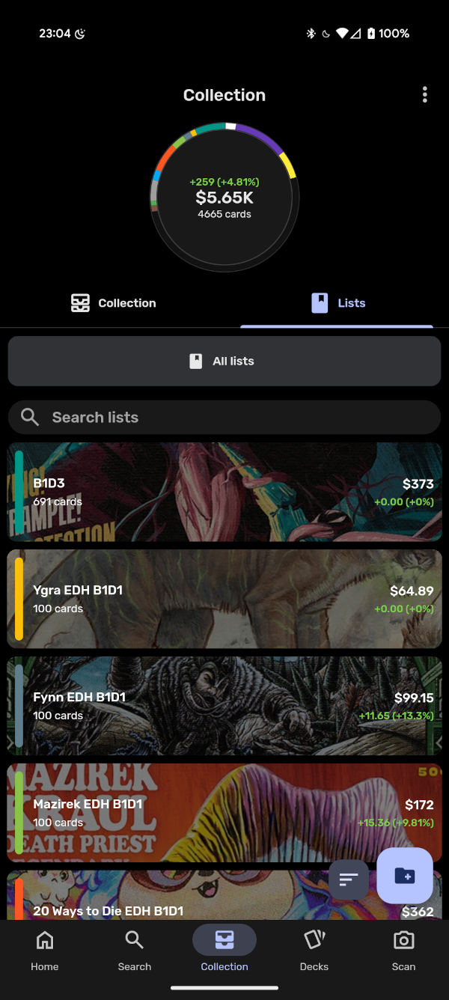

I've been collecting Magic: The Gathering products for most of my life. I had so many random boxes (once they were in a boot box) and collections of random sets that it caused my anxiety to flare up. I would swear to myself that I was going to *sit down* and sort them all out *one day*. Well, with my wedding around the corner and a house purchase within the next few months, I decided I needed to at the very minimum get my collection contained and not so spread out. Doing this with the help of two [BCW 6 Drawer stackables](https://www.amazon.com/gp/product/B0DBR6FTN4), I thought I'd be on my way to a cardboard box-free life and have something that my fiance/future wife would allow me to keep in my office since it "doesn't look like a trash pile", but all this did was spark that itch to *sit down* and *sort*. 

## Enter Manabox

[Manabox](https://manabox.app/) is something that I cannot recommend more to any level of Magic player. It helps (and truly was helping me) keep an eye on prices, cards in my collection, helped build commander decks, and let me brag to my friends whenever I saw them about said collection. My issue was that any time I went to *sit down* and *sort* I would inevitably be in an area where the light was either too much or not enough and the background for where to lay my cards wasn't what the app wanted. But that was literally the only feature I wanted to use more than anything, the card scanner was tempting me everytime I looked at that icon. I needed to find a way to make this work.

## Christmas, a 3D Printer, and a Dream

Christmas 2024, my 6 year old son (using my money) bought me a Creality Ender 3 V3 SE 3D printer and we have had a blast with it. I started thinking, "there has **GOT** to be MTG stuff I can print" and stumbled upon the best tool that anyone can [print](https://www.printables.com/model/1034404-card-slinger-30-for-mtg-manabox-app-for-sleeved-an) or [buy](https://cardslinger.shop/), the **Card Slinger**. This little contraption has a phone mount to perfectly hold your phone above the card catcher and with Manabox running it's card scanner portion you can get most of your collection sorted out in no time flat. However, there are a few tips that I'd like to offer for those of you who have differing sets in your boot boxes out there. 

* Before scanning anything, flip through the stack you're about to scan. Find all of the sets in it ([Scryfall](https://scryfall.com) has been helpful for my forgetful 35 year old brain) and set locks to keep the scanner from picking out a random set that the card may have also appeared in. 
* Save your scanning into lists based on their storage medium. As I said, I have the BCW boxes so I'll label mine "B1D1" for Box 1 Drawer 1 then just scan everything in that drawer. This will put everything in reverse order from how I had it in there, but at least I know what I have in what drawer and can work my way backwards when I need to find a specific card.
* Don't let the pricing freak you out. You have (most likely) spent WAY more than you'll ever get back in monitary value from your pieces of cardboard art. Just remember, it's not about the money, it's about the game (unless you're an investor, but then really, what are you doing with thousands of opened unsorted cards in boot boxes?).
* Lighting is essential for Manabox to see your cards. Kitchen tables are excellent or splurge on a nice LED floor lamp with a diffused covering.

## You got this!

I still have a long ways to go, but I've finally got a good start on handling my collection. So far, I've scanned about 4,500 cards with probably more than triple that left to scan, but it's a start! Good luck on your adventure, just don't get lost in the nostalgia sauce.

